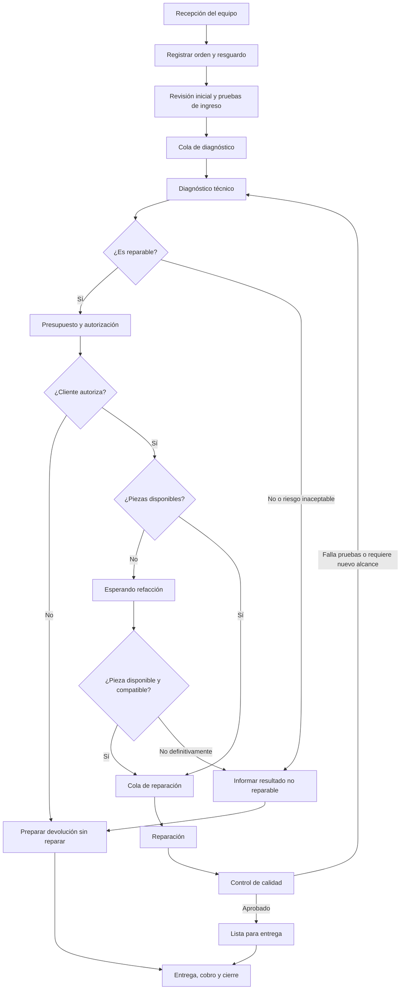

# Ciclo de vida propuesto para una orden de servicio

## Objetivo

Definir un flujo repetible para recibir un celular, diagnosticarlo, obtener autorización, reparar o resolver el caso sin reparación, y devolverlo al cliente. La propuesta contempla órdenes en varias sucursales, técnicos y personal de recepción.

## Qué se repite en los flujos consultados

No existe un único flujo obligatorio para todos los talleres. Al comparar documentación de software para talleres y guías de reparación de celulares, se repiten estas etapas:

1. Registrar cliente, equipo, falla reportada y condición física al recibirlo.
2. Asignar un folio y mantener el equipo identificado y localizable.
3. Diagnosticar y registrar hallazgos, piezas y costo estimado.
4. Esperar autorización antes de hacer trabajos o compras fuera del alcance aceptado.
5. Hacer visible la espera de piezas o de respuesta del cliente.
6. Reparar, probar el equipo y registrar el resultado antes de avisar que está listo.
7. Entregar el equipo, registrar pago y conservar evidencia del cierre.

Las guías revisadas incluyen además estados de diagnóstico pendiente de cliente, pedido y llegada de piezas, no reparable, reparación completada y equipo recogido. Los nombres y reglas exactos varían por negocio. Las fuentes consultadas se listan al final; varias son documentación o guías publicadas por proveedores de software, no una norma oficial del sector.

## Flujo recomendado

El diagrama es el camino habitual, no una secuencia rígida. Si la falla y el costo están claros desde la recepción, el diagnóstico puede ser una revisión breve y el presupuesto puede autorizarse en mostrador. Si se requiere investigación, el técnico debe documentar el diagnóstico antes de solicitar autorización.

## Estados que conviene manejar

Usaría estados operativos explícitos, más un motivo de espera y un resultado final. Evitaría que `No reparable` signifique automáticamente `Cerrada`: el taller todavía debe devolver el equipo y dejar asentado el cierre administrativo.

| Estado | Responsable habitual | Condición para entrar y siguiente acción |
|---|---|---|
| `Recibida` | Recepción | Se recibe el equipo y se crea folio, sucursal y registro de resguardo. Completar inspección de ingreso antes de enviarlo al área técnica. |
| `En cola de diagnóstico` | Recepción o encargado | El equipo quedó identificado y espera turno. Asignar un técnico para iniciar. |
| `En diagnóstico` | Técnico | El técnico inspecciona, prueba y documenta síntomas, hallazgos, riesgos, causa probable, piezas y tiempo estimado. |
| `Esperando autorización` | Recepción o encargado | El cliente recibió el diagnóstico y presupuesto. Registrar importe, vigencia, alcance y medio/fecha de solicitud; no iniciar trabajos fuera del alcance ya aprobado. |
| `Esperando refacción` | Compras o recepción | Existe autorización vigente, pero falta una pieza necesaria. Registrar pieza, proveedor, costo, fecha de pedido y fecha estimada. |
| `En cola de reparación` | Encargado técnico | La autorización y las piezas necesarias están listas. Asignar o confirmar técnico. |
| `En reparación` | Técnico | El técnico está trabajando. Registrar mano de obra, piezas utilizadas y avances relevantes. |
| `En control de calidad` | Técnico o revisor | La reparación reportó terminada. Ejecutar pruebas posteriores y compararlas con el estado inicial. |
| `Lista para entrega` | Recepción | QA aprobada y equipo preparado. Avisar al cliente e informar saldo, horario, garantía y documentos requeridos. |
| `En devolución sin reparar` | Recepción | El cliente rechazó el presupuesto o el diagnóstico concluyó que no conviene/no es posible reparar. Preparar equipo, accesorios y cobros acordados para devolver. |
| `Entregada` | Recepción | El equipo se devolvió físicamente al cliente o persona autorizada; registrar identidad/confirmación, fecha, saldo, comprobante y resultado. |
| `Cancelada` | Encargado | Se cancela antes de reparar o se interrumpe por una causa administrativa. No usarla para ocultar que el equipo sigue en el taller: registrar primero su ubicación y devolución o resguardo pendiente. |

### Motivos de espera

Además del estado, conviene tener un campo `motivo_espera` para priorizar y dar seguimiento. Valores iniciales sugeridos:

- `AUTORIZACION_CLIENTE`
- `REFACCION_PROVEEDOR`
- `INFORMACION_CLIENTE`
- `APROBACION_ADICIONAL`
- `SERVICIO_EXTERNO`

Para una primera versión, se pueden conservar `Esperando autorización` y `Esperando refacción` como estados separados porque son situaciones fáciles de entender en el tablero. El motivo de espera sigue siendo útil para los otros bloqueos y reportes.

## Pasos del proceso

### 1. Recepción y registro

La persona de recepción debe:

- Confirmar datos de contacto y sucursal que recibe el equipo.
- Registrar marca, modelo, color y número de serie o IMEI cuando corresponda.
- Capturar la falla como la describe el cliente, sin convertirla todavía en diagnóstico.
- Describir golpes, grietas, humedad visible, piezas faltantes y reparaciones previas observables.
- Registrar accesorios entregados por separado, por ejemplo funda, SIM o cargador.
- Tomar fotografías del estado físico con consentimiento y asociarlas a la orden.
- Hacer una lista breve de pruebas de ingreso posibles: encendido, pantalla, cámaras, botones, carga, audio, red y biometría según el modelo.
- Anotar las pruebas que no se pudieron realizar y el motivo, por ejemplo equipo sin encender o falta de autorización para desbloquearlo.
- Explicar las condiciones de diagnóstico, costos, tiempos aproximados, riesgos y medios de autorización.
- Etiquetar físicamente el equipo con el folio o código QR y registrar ubicación de resguardo.

No solicitar ni guardar PIN, contraseñas de cuenta o credenciales salvo que exista una necesidad concreta y un consentimiento explícito. Es preferible documentar que, sin acceso al dispositivo, ciertas pruebas posteriores estarán limitadas. Si el negocio decide manejar códigos de acceso, requerirá controles de acceso y retención específicos; no deben aparecer en notas generales o notificaciones.

Al confirmar el registro, entregar al cliente un comprobante con folio y datos esenciales de recepción.

### 2. Revisión inicial y diagnóstico técnico

El técnico debe recibir el equipo mediante su folio y registrar quién tomó custodia. La revisión debe distinguir:

- **Falla reportada**: lo que manifiesta el cliente.
- **Síntomas reproducidos**: lo que se pudo observar en pruebas.
- **Diagnóstico**: causa probable o confirmada, con evidencia relevante.
- **Alcance propuesto**: reparación sugerida, pieza y mano de obra.
- **Riesgo**: posibilidad de daño preexistente, pérdida de datos o resultado parcial, especialmente en equipos mojados, golpeados o con reparaciones previas.
- **Resultado de factibilidad**: reparable, reparable con condición, o no reparable con la capacidad/piezas disponibles.

Si el diagnóstico cambia el trabajo o el precio acordado en recepción, detener el trabajo adicional y pedir una nueva autorización. Mantener separados el diagnóstico técnico y la decisión comercial del cliente.

### 3. Presupuesto y autorización

La autorización debe guardar una evidencia consultable: aceptación digital, firma, respuesta desde el canal del cliente o registro de quién recibió la autorización verbal, fecha y alcance confirmado. Una llamada o mensaje sin contenido registrable no debería bastar para ampliar el trabajo.

El presupuesto debe indicar, según aplique:

- Trabajo y piezas incluidos.
- Importe total, impuestos y anticipo o cargo de diagnóstico.
- Tiempo estimado, condicionado a disponibilidad de piezas.
- Vigencia de la cotización.
- Riesgos y limitaciones de la reparación.
- Qué ocurrirá si el cliente rechaza el trabajo o no responde dentro del plazo acordado.

Si el cliente no acepta, la orden pasa a `En devolución sin reparar`. El sistema registra la decisión y cualquier cargo de diagnóstico conforme a las condiciones aceptadas y a la normativa aplicable. No iniciar la reparación por el mero hecho de que el cliente haya dejado el equipo.

Si se solicita un trabajo adicional durante la reparación, guardar una nueva versión de presupuesto y autorización antes de continuar con ese alcance. No sobrescribir la cotización anterior: el historial debe mostrar qué se ofreció y qué se aprobó.

### 4. Espera de refacciones

Usar `Esperando refacción` cuando la orden ya esté autorizada, pero falte una pieza. La orden debe mostrar como mínimo:

- Pieza, variante/calidad y cantidad requerida.
- Proveedor o fuente de abastecimiento.
- Fecha de solicitud o compra y fecha estimada de llegada.
- Estado de compra: pendiente, ordenada, enviada, recibida, cancelada o sin disponibilidad.
- Si hay anticipo del cliente, importe y condiciones de reembolso o aplicación.
- Último contacto con el cliente y siguiente fecha de actualización.

Cuando la pieza llegue, recepción o compras debe verificar modelo, variante y condición, asociarla a la orden y moverla a `En cola de reparación`. No marcarla recibida solo porque el proveedor notificó el envío.

Si el proveedor reporta que no existe o se descontinuó:

1. No sustituirla por una pieza diferente sin aprobación del cliente.
2. Informar alternativas compatibles, reparación parcial, espera sin fecha o devolución sin reparar.
3. Registrar la decisión del cliente y actualizar el presupuesto si cambia el precio o el alcance.
4. Si no hay alternativa aceptada, pasar a `En devolución sin reparar`, ajustar anticipos y registrar la causa `REFACCION_NO_DISPONIBLE`.

Definir recordatorios para piezas atrasadas y órdenes pendientes de autorización. Los plazos de seguimiento deben ser configurables por el taller, no codificados como una regla legal universal.

### 5. Reparación y registro del trabajo

Al iniciar, el técnico confirma que tiene la autorización y los componentes necesarios. Durante el trabajo registra:

- Hora de inicio/fin cuando el negocio requiera medir mano de obra.
- Técnico responsable y cambios de asignación.
- Piezas consumidas, números de parte y garantía del proveedor si aplica.
- Hallazgos nuevos, fotografías técnicas y trabajos realizados.
- Incidentes, daño adicional o cambio de alcance.

Si el técnico descubre que no es reparable después de comenzar, debe detenerse, documentar pruebas y causa, y avisar al encargado. No mover directamente la orden a `Entregada`: debe notificarse al cliente y prepararse la devolución.

### 6. Control de calidad

`En control de calidad` debe ser una etapa real, no una nota opcional. Antes de pasar a `Lista para entrega`:

- Probar la función relacionada con la reparación y otras funciones afectadas por el desmontaje.
- Comparar el resultado con las pruebas de ingreso; anotar las pruebas no ejecutables.
- Revisar montaje, carga, conectores, cámaras, audio, botones, sensores y red según el tipo de reparación.
- Confirmar que no quedan tornillos, adhesivos o piezas sueltas y limpiar el equipo.
- Registrar quién hizo QA, fecha y resultado por prueba.

Si una prueba falla, la orden regresa a `En reparación` o a `En diagnóstico` con el motivo documentado. Si requiere una pieza o autorización adicional, regresa a la espera correspondiente. No notificar como lista hasta aprobar QA o explicar explícitamente al cliente qué función quedó limitada y contar con su aceptación.

### 7. Equipo no reparable o reparación rechazada

“Reparación no realizada” puede ocurrir por causas distintas; registrar una razón concreta, por ejemplo:

- Daño de placa o corrosión sin reparación viable.
- Pieza inexistente, descontinuada o no compatible.
- Riesgo de agravar el daño superior al beneficio esperado.
- El costo supera lo que el cliente está dispuesto a pagar.
- Cliente rechaza el presupuesto o no autoriza el trabajo adicional.
- Falla no reproducible o el equipo funciona dentro de lo verificable.

La aplicación debe separar `resultado_tecnico` de `resultado_comercial`. Por ejemplo, el equipo puede ser técnicamente reparable, pero el cliente decide no autorizar la reparación.

Flujo de salida:

1. El técnico registra el diagnóstico, las pruebas y por qué no se reparó.
2. El encargado comunica el hallazgo, el cargo de diagnóstico y las opciones disponibles.
3. Se registra la decisión del cliente: aceptar alternativa, esperar pieza, retirar sin reparar o cancelar.
4. Se registra el estado final del equipo y de sus accesorios antes de entregarlo.
5. Se entrega, se registra el pago o saldo acordado y se cierra como `Entregada`, con resultado `NO_REPARADA`.

No desechar, reciclar ni conservar indefinidamente el equipo sin autorización y condiciones acordadas. Las reglas de cargos, plazos de resguardo y disposición de equipos deben revisarse conforme a las leyes locales y al contrato con el cliente.

### 8. Lista para entrega, entrega y cierre

Antes de avisar al cliente, comprobar que:

- QA está aprobada o existe una aceptación documentada de limitaciones.
- Se registraron piezas, mano de obra, descuentos y saldo final.
- Se aplicó la garantía ofrecida y su fecha de inicio según la política del taller.
- El dispositivo y los accesorios están identificados y preparados.

Al entregar:

- Confirmar que la persona que recoge está autorizada.
- Mostrar el funcionamiento y permitir que el cliente revise el equipo cuando sea posible.
- Explicar el trabajo realizado, las limitaciones conocidas y la garantía.
- Registrar pago, método, comprobante y saldo; no guardar datos de tarjeta.
- Registrar fecha/hora y confirmación de entrega.
- Cerrar la orden como `Entregada` una vez que el equipo haya salido del resguardo del taller.

Una orden `Lista para entrega` que no se recoge sigue abierta y bajo custodia. Se pueden programar recordatorios, pero cualquier cargo de almacenamiento o política de abandono debe comunicarse y cumplir la normativa aplicable.

### 9. Garantía o regreso del cliente

Si el cliente vuelve por un problema relacionado con una reparación reciente, crear una nueva orden vinculada a la original o un caso de garantía. No borrar ni reabrir silenciosamente el historial original. Registrar:

- Folio de la orden original y trabajo/pieza reclamados.
- Fecha y síntoma del regreso.
- Resultado de inspección y cobertura aplicada o motivo de exclusión.
- Si es garantía, cortesía o una nueva reparación con presupuesto.

Así se conserva el historial y se pueden analizar regresos y defectos por tipo de trabajo o pieza.

## Transiciones importantes

- No pasar a `En reparación` sin autorización vigente para el alcance realizado.
- No comprar piezas especiales o de alto costo sin la autorización/anticipo definidos por el negocio.
- Si cambian alcance o precio, detenerse y obtener aprobación adicional.
- QA aprobada es requisito para `Lista para entrega`, salvo excepción documentada y aceptada.
- `No reparable` describe el resultado técnico; `Entregada` describe la devolución física. Son datos distintos.
- `Cancelada` no debe ocultar un equipo que continúa en el taller.
- Toda transición registra usuario, fecha/hora, estado anterior/nuevo, motivo y nota; las notas pueden editarse con historial, no eliminando evidencia.
- Los cambios de estado pueden disparar una notificación al cliente, pero solo después de guardar exitosamente la transición.

## Notificaciones recomendadas

| Momento | Mensaje al cliente |
|---|---|
| Orden recibida | Folio, equipo recibido, resumen de condición y cómo consultar el estado. |
| Diagnóstico listo | Hallazgo, presupuesto, vigencia y forma de autorizar o rechazar. |
| Refacción pendiente | Qué pieza falta, fecha estimada y cuándo recibirá la siguiente actualización. |
| Retraso o cambio de fecha | Motivo, nueva expectativa y opciones si la espera ya no le conviene. |
| Reparación lista | Confirmar que pasó pruebas, sucursal, horario, saldo y garantía. |
| No reparable o reparación rechazada | Explicar el resultado, cargos acordados y opciones para retirar el equipo. |
| Entrega | Comprobante, trabajo realizado y términos de garantía. |

Usar plantillas breves y no incluir información sensible del equipo. La persona responsable debe poder corregir o cancelar un mensaje automático incorrecto antes de enviarlo cuando el canal lo permita.

## Datos que conviene guardar en la orden

- Identificadores: folio, empresa, sucursal, cliente, dispositivo.
- Custodia: quién recibió, quién tuvo asignado el equipo, ubicación física y fechas de movimiento.
- Ingreso: falla reportada, condición, accesorios, fotos y pruebas iniciales.
- Trabajo: diagnóstico, versiones de presupuesto, aprobaciones, asignaciones, notas y piezas.
- Tiempos: entrada, cada transición, fecha prometida y fechas estimadas de pieza.
- QA: lista de pruebas, resultado, responsable y observaciones.
- Salida: resultado reparada/no reparada, motivo, pago, garantía y confirmación de entrega.

Para el tablero móvil de operación, mostrar primero folio, cliente, modelo, sucursal, estado, técnico, tiempo en estado y próxima acción. Un indicador de antigüedad en `Esperando autorización`, `Esperando refacción` y `Lista para entrega` ayuda a detectar órdenes estancadas.

## Fuentes consultadas

- [My Gadget Repairs: Walk-in Repair – Workflow](https://docs.mygadgetrepairs.com/tickets/walk-in-repair-workflow/). Documentación de producto con un flujo de ticket, responsabilidad de recepción y técnico, estados que incluyen diagnóstico pendiente de cliente, no reparable, pedido/llegada de piezas, reparación completada y recogida.
- [Fixitize: Cell Phone Repair Workflow From Check-In to Pickup](https://fixitize.com/blog/how-cell-phone-repair-shops-manage-repairs-from-check-in-to-pickup/). Guía de proveedor sobre inspección de ingreso, fotos, consentimiento, diagnóstico y presupuesto, espera de piezas, QA y entrega.
- [PhoneRepairPOS: Repair ticket workflow: from intake to pickup](https://phonerepairpos.app/blog/repair-ticket-workflow-from-intake-to-pickup). Guía que organiza el proceso en ingreso, diagnóstico, espera de piezas, reparación, QA, listo para recoger y pago/entrega.
- [PhoneMistri: Repair Job Tracking Workflow: From Device Intake to Delivery](https://phonemistri.com/blog/repair-job-tracking-workflow). Guía de seguimiento con datos de ingreso, identificación del equipo, autorización, piezas, notificaciones, pago y entrega.
- [Fixitize: 7 Workflow Issues in Cell Phone Repair Shops & How to Fix Each One](https://fixitize.com/blog/common-workflow-problems-in-cell-phone-repair-shops/). Guía sobre puntos frecuentes de atasco, como aprobaciones pendientes, piezas, cambios de diagnóstico, QA y equipos listos sin recoger.

Estas fuentes sirven para comparar prácticas y funciones comunes de sistemas para talleres. No establecen por sí solas obligaciones legales ni una única política correcta para cargos de diagnóstico, anticipos, garantías o equipos abandonados; esas reglas deben definirse para el negocio y la jurisdicción donde opere.
