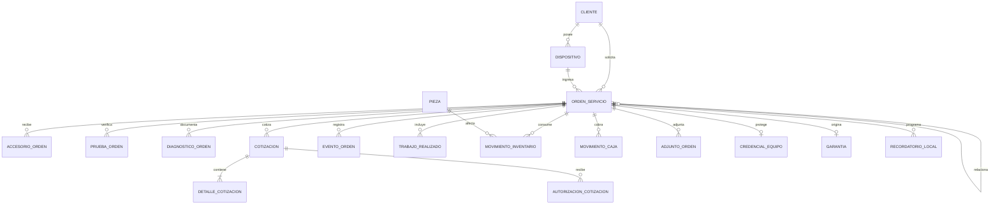

# Entidades de la base de datos del taller local

## 1. Propósito

Este documento propone las entidades de persistencia para la aplicación descrita en [funcionalidades-taller-local-android.md](funcionalidades-taller-local-android.md). El modelo es para un taller, una persona usuaria y un dispositivo Android; no contempla cuentas en línea, API, sucursales ni sincronización.

Se propone una base de datos relacional local, por ejemplo SQLite mediante Room. Los nombres son lógicos y se pueden adaptar a las convenciones del proyecto. La base operativa debe residir en el almacenamiento privado de la aplicación; las fotografías y otros archivos grandes pueden almacenarse como archivos privados referenciados por la base.

## 2. Convenciones

- Cada entidad tiene una clave primaria `id` UUID almacenada como `TEXT`, excepto catálogos estáticos con códigos estables.
- Implementar referencias con claves foráneas. Restringir el borrado de datos históricos; reservar cascadas para datos auxiliares sin valor histórico.
- Guardar fechas como ISO-8601 UTC y presentarlas según la zona horaria configurada.
- Guardar importes como enteros en unidades menores de la moneda (por ejemplo, centavos), nunca como `REAL`. Conservar el código de moneda cuando no sea inequívoco desde la configuración.
- Persistir códigos controlados de estados y tipos, no las etiquetas traducidas de la interfaz.
- Aceptar `NULL` en datos personales opcionales y evitar recolectar datos innecesarios.
- Las claves de cifrado no se guardan en estas tablas; se administran mediante Android Keystore.

## 3. Relaciones principales

La relación recursiva de `ORDEN_SERVICIO` permite vincular una orden de garantía, cortesía o reingreso con la orden original. `CONFIGURACION_TALLER`, `CONFIGURACION_ACCESO_LOCAL` y `REGISTRO_RESPALDO` son entidades singleton o locales independientes del flujo de órdenes.

## 4. Entidades

### 4.1 Configuración y autenticación

#### `ConfiguracionTaller`

Una sola fila (clave `id` constante) con preferencias y datos generales del negocio.

| Campo | Tipo | Reglas y uso |
|---|---|---|
| `id` | TEXT | PK singleton. |
| `nombre`, `telefono`, `direccion` | TEXT | Opcionales; pueden aparecer en comprobantes. |
| `moneda_codigo` | TEXT | Código ISO 4217, por ejemplo `MXN`. |
| `zona_horaria` | TEXT | Identificador IANA, por ejemplo `America/Mexico_City`. |
| `prefijo_folio` | TEXT | Prefijo configurable. |
| `siguiente_folio` | INTEGER | Secuencia asignada dentro de una transacción. |
| `impuesto_tasa` | INTEGER/TEXT | Valor decimal escalado o textual; no usar punto flotante. |
| `cargo_diagnostico_minor` | INTEGER | Cargo predeterminado en unidades menores. |
| `dias_vigencia_cotizacion` | INTEGER | Valor predeterminado configurable. |
| `dias_garantia_predeterminados` | INTEGER | Valor predeterminado; cada orden conserva las condiciones aplicadas. |
| `dias_recordatorio_*` | INTEGER | Plazos configurables de seguimiento. |
| `creado_en`, `actualizado_en` | TEXT | Fechas UTC. |

Cambiar la configuración no debe modificar folios, precios, garantías o comprobantes históricos.

#### `ConfiguracionAccesoLocal`

Una fila singleton con preferencias de acceso. La autenticación biométrica y la credencial del dispositivo se delegan a Android; no almacenar plantillas biométricas.

| Campo | Tipo | Reglas y uso |
|---|---|---|
| `id` | TEXT | PK singleton. |
| `metodo` | TEXT | `PASSWORD_APP` o `CREDENCIAL_ANDROID`. |
| `verificador_contrasena` | BLOB | Solo para contraseña propia; derivado con algoritmo resistente a fuerza bruta, nunca reversible. |
| `sal_contrasena` | BLOB | Sal aleatoria si se usa contraseña propia. |
| `algoritmo_contrasena` | TEXT | Algoritmo y parámetros de derivación. |
| `alias_clave_keystore` | TEXT | Alias de referencia; nunca guardar el material de la clave. |
| `tiempo_bloqueo_segundos` | INTEGER | Tiempo configurable antes de pedir autenticación otra vez. |
| `actualizado_en` | TEXT | Fecha UTC. |

La recuperación es local, sin servidor. La interfaz debe explicar el riesgo de perder acceso si se pierde la contraseña o la clave protegida por Android Keystore.

### 4.2 Clientes, dispositivos y órdenes

#### `Cliente`

| Campo | Tipo | Reglas y uso |
|---|---|---|
| `id` | TEXT | PK. |
| `nombre` | TEXT | Requerido, salvo que se permita una recepción anónima. |
| `telefono`, `correo` | TEXT | Opcionales; no imponer unicidad, pues pueden compartirse. |
| `notas` | TEXT | Opcionales; no guardar secretos. |
| `creado_en`, `actualizado_en` | TEXT | Fechas UTC. |
| `eliminado_en` | TEXT NULL | Borrado lógico o anonimización si existen órdenes. |

#### `Dispositivo`

Ficha reutilizable del equipo. Los datos observados al recibirlo se copian también a la orden para preservar la historia.

| Campo | Tipo | Reglas y uso |
|---|---|---|
| `id` | TEXT | PK. |
| `cliente_id` | TEXT | FK a `Cliente.id`, requerido. |
| `tipo`, `marca`, `modelo`, `color` | TEXT | Tipo, por ejemplo teléfono o tableta. |
| `numero_serie`, `imei` | TEXT NULL | Opcionales; limitar exposición en pantallas y exportaciones. |
| `creado_en`, `actualizado_en` | TEXT | Fechas UTC. |

Índices sugeridos: `cliente_id`, `imei` y `numero_serie`. No exigir identificador único para equipos dual-SIM, duplicados o datos corregidos.

#### `OrdenServicio`

Entidad central del proceso. Mantiene referencias y una instantánea de los datos relevantes de recepción.

| Campo | Tipo | Reglas y uso |
|---|---|---|
| `id` | TEXT | PK. |
| `folio` | TEXT | Requerido, UNIQUE y nunca reutilizado, incluso si se cancela la orden. |
| `cliente_id` | TEXT | FK a `Cliente.id`; nullable si se acepta recepción anónima. |
| `dispositivo_id` | TEXT | FK a `Dispositivo.id`; nullable para equipo ocasional. |
| `orden_origen_id` | TEXT NULL | FK recursiva para garantía, cortesía o reingreso; no puede ser la propia orden. |
| `tipo_relacion_origen` | TEXT NULL | `GARANTIA`, `CORTESIA`, `REINGRESO` u otro código definido. |
| `cliente_nombre_snapshot`, `cliente_contacto_snapshot` | TEXT | Referencia histórica mínima para recepción y comprobantes. |
| `tipo_equipo_snapshot`, `marca_snapshot`, `modelo_snapshot`, `color_snapshot` | TEXT | Instantánea del equipo al recibirlo. |
| `serie_snapshot`, `imei_snapshot` | TEXT NULL | Opcionales y de acceso limitado. |
| `falla_reportada` | TEXT | Manifestación del cliente, separada del diagnóstico. |
| `condicion_ingreso` | TEXT | Estado físico y observaciones iniciales. |
| `estado` | TEXT | Estado controlado del ciclo de vida. |
| `resultado_tecnico` | TEXT NULL | `REPARABLE`, `REPARABLE_CON_CONDICION`, `NO_REPARABLE`. |
| `resultado_comercial` | TEXT NULL | Por ejemplo `REPARADA`, `NO_REPARADA`, `PENDIENTE`. |
| `ubicacion_resguardo` | TEXT NULL | Ubicación actual dentro del taller. |
| `recibida_en` | TEXT | Fecha UTC requerida. |
| `fecha_prometida`, `entregada_en`, `cerrada_en` | TEXT NULL | Fechas UTC. |
| `creada_en`, `actualizada_en` | TEXT | Auditoría local. |
| `eliminada_en` | TEXT NULL | Preferir cancelar o anonimizar en vez de borrar órdenes históricas. |

Índices sugeridos: `folio` único; `estado`, `recibida_en`, `cliente_id`, `dispositivo_id` y `orden_origen_id`. Actualizar estado e insertar `EventoOrden` en una misma transacción.

#### `AccesorioOrden`

Una fila por accesorio recibido (funda, cargador, SIM, bandeja, etc.).

| Campo | Tipo | Reglas y uso |
|---|---|---|
| `id` | TEXT | PK. |
| `orden_id` | TEXT | FK a `OrdenServicio.id`. |
| `descripcion` | TEXT | Requerido. |
| `cantidad` | INTEGER | Mayor que cero. |
| `condicion_ingreso` | TEXT NULL | Estado al recibirlo. |
| `devuelto` | INTEGER | Booleano; predeterminado falso. |
| `condicion_salida`, `nota` | TEXT NULL | Estado y observación de salida; no guardar secretos. |

### 4.3 Inspección, diagnóstico y autorización

#### `PruebaOrden`

Una fila por prueba de ingreso o de control de calidad.

| Campo | Tipo | Reglas y uso |
|---|---|---|
| `id` | TEXT | PK. |
| `orden_id` | TEXT | FK a `OrdenServicio.id`. |
| `etapa` | TEXT | `INGRESO` o `CONTROL_CALIDAD`. |
| `nombre_prueba` | TEXT | Encendido, pantalla, cámara, carga, audio, red, biometría, etc. |
| `resultado` | TEXT | `APROBADA`, `FALLIDA`, `NO_REALIZADA`, `LIMITADA`. |
| `observacion`, `motivo_no_realizada` | TEXT NULL | Detalle y motivo. |
| `prueba_ingreso_id` | TEXT NULL | FK recursiva a la prueba inicial comparada por QA. |
| `registrada_en` | TEXT | Fecha UTC. |

#### `DiagnosticoOrden`

Conserva diagnósticos y reevaluaciones sin sobrescribir versiones anteriores.

| Campo | Tipo | Reglas y uso |
|---|---|---|
| `id` | TEXT | PK. |
| `orden_id` | TEXT | FK a `OrdenServicio.id`. |
| `numero_version` | INTEGER | Secuencia; UNIQUE junto con `orden_id`. |
| `sintomas_reproducidos`, `hallazgos`, `causa_probable` | TEXT | Evidencia técnica; indicar si la causa es probable o confirmada. |
| `factibilidad` | TEXT | `REPARABLE`, `CONDICIONAL`, `NO_REPARABLE`. |
| `riesgos`, `limitaciones` | TEXT NULL | Riesgos de daño, datos o resultado parcial. |
| `tiempo_estimado_minutos` | INTEGER NULL | Estimación opcional. |
| `creado_en` | TEXT | Fecha UTC. |

#### `CatalogoServicio`

| Campo | Tipo | Reglas y uso |
|---|---|---|
| `id` | TEXT | PK. |
| `codigo` | TEXT NULL | Código único opcional. |
| `nombre`, `descripcion` | TEXT | Nombre y descripción. |
| `precio_base_minor` | INTEGER | Precio en unidades menores. |
| `activo` | INTEGER | Booleano; desactivar si ya aparece en cotizaciones. |
| `creado_en`, `actualizado_en` | TEXT | Fechas UTC. |

#### `Cotizacion` y `DetalleCotizacion`

Una orden puede tener varias versiones. Los detalles guardan una instantánea de descripción y precio para preservar cotizaciones históricas.

`Cotizacion`:

| Campo | Tipo | Reglas y uso |
|---|---|---|
| `id` | TEXT | PK. |
| `orden_id` | TEXT | FK a `OrdenServicio.id`. |
| `numero_version` | INTEGER | UNIQUE junto con `orden_id`. |
| `subtotal_minor`, `descuento_minor`, `impuesto_minor`, `total_minor` | INTEGER | Unidades menores; validar el cálculo y no aceptar negativos indebidos. |
| `moneda_codigo` | TEXT | Código de moneda. |
| `vigente_hasta` | TEXT NULL | Fecha de vencimiento. |
| `tiempo_estimado_minutos` | INTEGER NULL | Puede depender de refacciones. |
| `riesgos_limitaciones`, `condiciones` | TEXT NULL | Términos de esta versión. |
| `estado` | TEXT | `BORRADOR`, `ENVIADA`, `ACEPTADA`, `RECHAZADA`, `VENCIDA`, `SUSTITUIDA`. |
| `creada_en` | TEXT | Fecha UTC. |

`DetalleCotizacion`:

| Campo | Tipo | Reglas y uso |
|---|---|---|
| `id` | TEXT | PK. |
| `cotizacion_id` | TEXT | FK a `Cotizacion.id`. |
| `servicio_id` | TEXT NULL | FK a `CatalogoServicio.id`; nulo para concepto libre. |
| `tipo` | TEXT | `MANO_DE_OBRA`, `PIEZA`, `DIAGNOSTICO`, `OTRO`. |
| `descripcion_snapshot` | TEXT | Descripción incluida en la oferta. |
| `cantidad` | INTEGER | Mayor que cero. |
| `precio_unitario_minor`, `importe_minor` | INTEGER | Importes capturados al cotizar. |
| `pieza_id` | TEXT NULL | FK a `Pieza.id` cuando aplique. |

#### `AutorizacionCotizacion`

Registra aceptación o rechazo sin sobrescribir la decisión anterior.

| Campo | Tipo | Reglas y uso |
|---|---|---|
| `id` | TEXT | PK. |
| `cotizacion_id` | TEXT | FK a `Cotizacion.id`. |
| `decision` | TEXT | `ACEPTADA` o `RECHAZADA`. |
| `canal` | TEXT | `PRESENCIAL`, `LLAMADA`, `MENSAJE`, `FIRMA`, `OTRO`. |
| `alcance_confirmado` | TEXT | Alcance específico aceptado o rechazado. |
| `evidencia_adjunto_id` | TEXT NULL | FK a `AdjuntoOrden.id` si hay evidencia adjunta. |
| `nota` | TEXT NULL | No incluir datos de desbloqueo. |
| `registrada_en` | TEXT | Fecha UTC. |

### 4.4 Historial, trabajo y adjuntos

#### `EventoOrden`

Bitácora append-only de transiciones y acciones importantes. Las correcciones se agregan como nuevos eventos.

| Campo | Tipo | Reglas y uso |
|---|---|---|
| `id` | TEXT | PK. |
| `orden_id` | TEXT | FK a `OrdenServicio.id`. |
| `tipo_evento` | TEXT | `CAMBIO_ESTADO`, `NOTA`, `ENTREGA`, `CANCELACION`, etc. |
| `estado_anterior`, `estado_nuevo` | TEXT NULL | Requeridos para transición. |
| `motivo`, `nota` | TEXT NULL | Nunca incluir credenciales o secretos. |
| `registrado_en` | TEXT | Fecha UTC. |
| `actor` | TEXT | Identificador local estable, por ejemplo `USUARIO_LOCAL`. |

#### `TrabajoRealizado`

| Campo | Tipo | Reglas y uso |
|---|---|---|
| `id` | TEXT | PK. |
| `orden_id` | TEXT | FK a `OrdenServicio.id`. |
| `descripcion` | TEXT | Trabajo, hallazgo o incidente. |
| `inicio_en`, `fin_en` | TEXT NULL | Horario opcional. |
| `costo_mano_obra_minor` | INTEGER NULL | Importe asociado cuando aplique. |
| `creado_en` | TEXT | Fecha UTC. |

#### `AdjuntoOrden`

Metadatos de fotos, documentos, firmas y evidencia; el contenido vive en archivos privados locales.

| Campo | Tipo | Reglas y uso |
|---|---|---|
| `id` | TEXT | PK. |
| `orden_id` | TEXT | FK a `OrdenServicio.id`. |
| `categoria` | TEXT | `FOTO_INGRESO`, `FOTO_TECNICA`, `FOTO_SALIDA`, `AUTORIZACION`, `COMPROBANTE`, `OTRO`. |
| `ruta_relativa` | TEXT | Ruta relativa privada, nunca absoluta. |
| `nombre_original` | TEXT NULL | Opcional; evitar datos sensibles en el nombre. |
| `mime_type`, `tamano_bytes`, `hash_contenido` | TEXT/INTEGER | Tipo, tamaño e integridad. |
| `consentimiento_registrado` | INTEGER | Booleano cuando se necesite consentimiento para la foto. |
| `creado_en` | TEXT | Fecha UTC. |

Al borrar un adjunto, gestionar también el archivo correspondiente; el borrado debe ser recuperable ante fallo parcial o mediante una cola de limpieza local.

### 4.5 Refacciones e inventario

#### `Pieza`

| Campo | Tipo | Reglas y uso |
|---|---|---|
| `id` | TEXT | PK. |
| `codigo`, `numero_parte` | TEXT NULL | Identificadores opcionales. |
| `nombre`, `variante`, `calidad` | TEXT | Distinguir modelo, color, capacidad o calidad cuando aplique. |
| `costo_unitario_minor`, `precio_venta_minor` | INTEGER | Unidades menores de moneda. |
| `existencia_minima` | INTEGER | Umbral de alerta no negativo. |
| `activo` | INTEGER | Desactivar en vez de borrar si hay movimientos. |
| `creado_en`, `actualizado_en` | TEXT | Fechas UTC. |

La existencia actual se calcula sumando movimientos confirmados. Si se guarda un saldo por rendimiento, actualizarlo en la misma transacción y reconciliarlo contra los movimientos.

#### `MovimientoInventario`

Libro de entradas, consumos, reservas, liberaciones, devoluciones y ajustes. Corregir mediante movimientos compensatorios, sin borrar movimientos previos.

| Campo | Tipo | Reglas y uso |
|---|---|---|
| `id` | TEXT | PK. |
| `pieza_id` | TEXT | FK a `Pieza.id`. |
| `orden_id` | TEXT NULL | FK a `OrdenServicio.id` cuando se asocia a una orden. |
| `tipo` | TEXT | `ENTRADA`, `CONSUMO`, `RESERVA`, `LIBERACION`, `DEVOLUCION`, `AJUSTE`. |
| `cantidad` | INTEGER | Positiva; el tipo determina el efecto sobre la existencia. |
| `costo_unitario_minor` | INTEGER NULL | Costo al momento del movimiento. |
| `proveedor`, `numero_pedido` | TEXT NULL | Datos de abastecimiento. |
| `estado_compra` | TEXT NULL | `PENDIENTE`, `ORDENADA`, `ENVIADA`, `RECIBIDA`, `CANCELADA`, `SIN_DISPONIBILIDAD`. |
| `fecha_estimada`, `confirmada_en` | TEXT NULL | Estimación y recepción física confirmada. |
| `motivo` | TEXT NULL | Motivo de ajuste o devolución. |
| `creado_en` | TEXT | Fecha UTC. |

### 4.6 Caja, garantías y recordatorios

#### `MovimientoCaja`

Libro único de pagos, anticipos, reembolsos y gastos.

| Campo | Tipo | Reglas y uso |
|---|---|---|
| `id` | TEXT | PK. |
| `orden_id` | TEXT NULL | FK a `OrdenServicio.id`; nulo para gasto general. |
| `movimiento_origen_id` | TEXT NULL | FK a `MovimientoCaja.id` para vincular un reembolso con el movimiento original. |
| `tipo` | TEXT | `ANTICIPO`, `PAGO`, `REEMBOLSO`, `GASTO`, `AJUSTE`. |
| `direccion` | TEXT | `ENTRADA` o `SALIDA`, coherente con el tipo. |
| `importe_minor` | INTEGER | Mayor que cero. |
| `moneda_codigo` | TEXT | Código de moneda. |
| `metodo_pago` | TEXT | Efectivo, transferencia, tarjeta u otro; no guardar número, CVV ni datos de tarjeta. |
| `referencia_no_sensible` | TEXT NULL | Folio externo no secreto si se necesita. |
| `descripcion` | TEXT NULL | Concepto de gasto o nota breve. |
| `registrado_en` | TEXT | Fecha UTC. |

Calcular saldos desde cotizaciones aceptadas y movimientos vinculados; validar reembolsos y evitar inconsistencias.

#### `Garantia`

| Campo | Tipo | Reglas y uso |
|---|---|---|
| `id` | TEXT | PK. |
| `orden_id` | TEXT | FK a `OrdenServicio.id`; UNIQUE si solo hay una garantía por orden. |
| `fecha_inicio`, `fecha_fin` | TEXT | Periodo de cobertura. |
| `cobertura`, `exclusiones` | TEXT | Condiciones acordadas. |
| `creada_en` | TEXT | Fecha UTC. |

Una orden de regreso apunta a la original con `OrdenServicio.orden_origen_id`.

#### `RecordatorioLocal`

Tareas programadas localmente; no son mensajes enviados al cliente.

| Campo | Tipo | Reglas y uso |
|---|---|---|
| `id` | TEXT | PK. |
| `orden_id` | TEXT | FK a `OrdenServicio.id`. |
| `tipo` | TEXT | `SEGUIMIENTO_AUTORIZACION`, `REFACCION_ATRASADA`, `EQUIPO_LISTO`, `OTRO`. |
| `programado_en` | TEXT | Fecha UTC. |
| `completado_en` | TEXT NULL | Fecha de resolución. |
| `estado` | TEXT | `PENDIENTE`, `COMPLETADO`, `CANCELADO`. |
| `nota` | TEXT NULL | Sin secretos. |

### 4.7 Credenciales temporales y respaldos

#### `CredencialEquipo`

Entidad separada y de acceso restringido para el patrón, PIN o contraseña opcional del dispositivo del cliente. Máximo una credencial vigente por orden. Nunca guardar claves de cuentas del cliente.

| Campo | Tipo | Reglas y uso |
|---|---|---|
| `id` | TEXT | PK. |
| `orden_id` | TEXT | FK a `OrdenServicio.id`, UNIQUE. |
| `tipo` | TEXT | `PATRON`, `PIN`, `CONTRASENA`. |
| `valor_cifrado` | BLOB NULL | Cifrado autenticado; nunca texto claro, limpiar al eliminar. |
| `nonce` | BLOB NULL | Nonce único; limpiar junto con el valor cifrado. |
| `version_clave` | TEXT NULL | Referencia a clave/versión, nunca la clave. |
| `consentimiento_en` | TEXT | Fecha y hora de consentimiento explícito. |
| `proposito` | TEXT | Pruebas autorizadas que requieren acceso. |
| `eliminar_en` | TEXT | Fecha de eliminación; por defecto al entregar o cancelar. |
| `eliminada_en` | TEXT NULL | Fecha de eliminación; puede conservarse como evidencia sin retener el secreto. |

Descifrar solo en memoria tras autenticación local reciente. No copiar el valor al portapapeles ni a logs, notas, notificaciones, comprobantes o exportaciones comunes. Excluirlo de respaldos por defecto.

#### `RegistroRespaldo`

Metadatos locales para mostrar el último respaldo; el archivo no forma parte de la base operativa.

| Campo | Tipo | Reglas y uso |
|---|---|---|
| `id` | TEXT | PK. |
| `creado_en` | TEXT | Fecha UTC. |
| `version_formato` | TEXT | Versión del esquema exportado. |
| `resultado` | TEXT | `COMPLETADO`, `FALLIDO`, `VALIDADO`, `RESTAURADO`. |
| `incluye_credenciales` | INTEGER | Booleano; no copiar secretos a esta tabla. |
| `elementos`, `tamano_bytes` | INTEGER/TEXT | Resumen y tamaño cuando se determinen. |
| `ubicacion_etiqueta` | TEXT NULL | Nombre descriptivo opcional, no ruta obligatoria. |

## 5. Valores controlados

| Campo | Valores iniciales sugeridos |
|---|---|
| `OrdenServicio.estado` | `RECIBIDA`, `COLA_DIAGNOSTICO`, `EN_DIAGNOSTICO`, `ESPERANDO_AUTORIZACION`, `ESPERANDO_REFACCION`, `COLA_REPARACION`, `EN_REPARACION`, `CONTROL_CALIDAD`, `LISTA_ENTREGA`, `DEVOLUCION_SIN_REPARAR`, `ENTREGADA`, `CANCELADA`. |
| `OrdenServicio.resultado_tecnico` | `REPARABLE`, `REPARABLE_CON_CONDICION`, `NO_REPARABLE`. |
| `OrdenServicio.resultado_comercial` | `REPARADA`, `NO_REPARADA`, `PENDIENTE`. |
| `MovimientoInventario.tipo` | `ENTRADA`, `CONSUMO`, `RESERVA`, `LIBERACION`, `DEVOLUCION`, `AJUSTE`. |
| `MovimientoCaja.tipo` | `ANTICIPO`, `PAGO`, `REEMBOLSO`, `GASTO`, `AJUSTE`. |
| `RecordatorioLocal.tipo` | `SEGUIMIENTO_AUTORIZACION`, `REFACCION_ATRASADA`, `EQUIPO_LISTO`, `OTRO`. |

Implementar estos valores mediante `CHECK`, enums de la aplicación o catálogos cuando se requieran valores editables. Guardar códigos estables, no etiquetas visibles.

## 6. Integridad, índices y retención

- Activar claves foráneas SQLite en cada conexión.
- Asignar folios dentro de una transacción y no reutilizarlos.
- Impedir referencias circulares en `orden_origen_id` y referencias a órdenes inexistentes.
- Cambiar el estado e insertar su `EventoOrden` de forma atómica.
- Una autorización debe referirse a la versión exacta de cotización aceptada.
- No borrar físicamente eventos, cotizaciones aceptadas, pagos ni movimientos de inventario; corregir mediante registros compensatorios.
- Al entregar o cancelar, eliminar el secreto de la credencial temporal y su clave de datos dedicada conforme a la política. Un respaldo solo puede incluirlo con consentimiento explícito y cifrado; la restauración lo protege con una clave nueva del dispositivo destino.
- Guardar adjuntos con rutas relativas, respaldarlos junto con la base y comprobar su hash al restaurar.
- Excluir base y claves sensibles de mecanismos de copia automática del sistema operativo que evadan el respaldo cifrado controlado por la aplicación.
- Índices recomendados: folio único; estado/fecha de orden; cliente/dispositivo; orden/fecha de eventos; orden/versión de cotización; pieza/fecha de inventario; orden/fecha de caja; fecha/estado de recordatorios.
- Mantener migraciones versionadas que preserven registros, adjuntos y compatibilidad con los respaldos soportados.

## 7. Entidades fuera de alcance

No se requieren tablas de empresas, sucursales, usuarios múltiples, perfiles, permisos, comisiones ni sincronización. La autenticación es local y de una persona; no se persisten plantillas biométricas. Tampoco se necesita una tabla `Paises` salvo que se requiera un catálogo estructurado de direcciones.

El archivo `modelo.drawio` representa una propuesta anterior con algunas de esas entidades y datos de orden concentrados en una sola tabla. Este diseño conserva `OrdenServicio` como entidad central y separa inspecciones, cotizaciones, pagos, inventario, evidencia e historial en entidades relacionadas.
